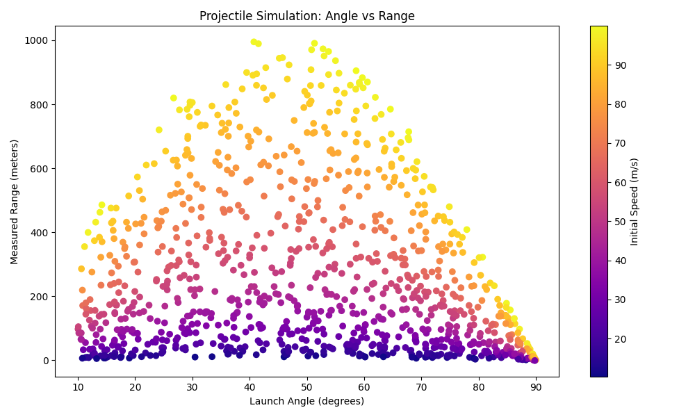
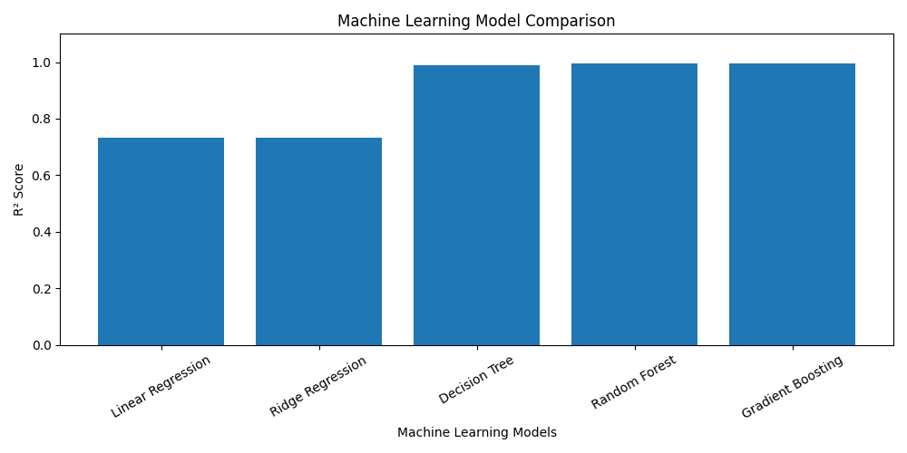

# Synthetic Data Generation Using Physics-Based Simulation for Machine Learning

This repository documents the process of generating synthetic training data using mathematical modelling and simulation. The project utilizes kinematic physics equations to create a dataset representing projectile motion, which is subsequently used to benchmark various regression-based machine learning algorithms.

---

## Project Overview
The primary objective of this study is to demonstrate the effectiveness of simulation-driven data generation. By modelling a physical system (projectile motion) governed by well-defined mathematical equations, a controlled environment is created to evaluate how accurately different machine learning models can learn nonlinear physical relationships from noisy sensor data.

---

## Simulation Methodology
Instead of using discrete-event simulators, this project employs a continuous mathematical model derived from classical mechanics.

- **System Modeled:** Projectile Motion (Ballistics)  
- **Mathematical Basis:** Kinematic equations for projectile range  
- **Noise Injection:** Gaussian noise is added to simulate real-world sensor inaccuracies  

### Governing Equation
The simulation is based on the standard projectile range equation:

R = (v² · sin(2θ)) / g  

Where:  
- **v** is the launch velocity  
- **θ** is the launch angle  
- **g** is gravitational acceleration (9.81 m/s²)

### Simulation Visualization
The following plot illustrates the relationship between launch angle and measured range, with color indicating the initial velocity. The shape of the distribution confirms the expected physical behavior of projectile motion.



---

## Simulation Parameters
The following parameters were randomized within predefined bounds to generate a dataset of 1000 samples.

| Parameter | Description | Lower Bound | Upper Bound |
|---------|-------------|-------------|-------------|
| Velocity (v) | Initial launch speed | 10 m/s | 100 m/s |
| Angle (θ) | Launch angle | 10° | 90° |
| Gravity (g) | Acceleration due to gravity | 9.81 m/s² | Fixed |

---

## Workflow
1. **Physics Simulation:** A custom Python function acts as the physics engine, computing the theoretical projectile range using velocity and angle as inputs.  
2. **Data Generation:** A loop executes 1000 independent simulation runs, injecting Gaussian noise to mimic sensor measurement errors.  
3. **Visualization:** Generated data is visualized to verify physical consistency.  
4. **Model Training:** Multiple regression models are trained on 80% of the dataset.  
5. **Evaluation:** Models are evaluated on the remaining 20% using R² score and RMSE.  

---

## Machine Learning Models
The following regression models were implemented and compared:

- Linear Regression  
- Ridge Regression  
- Decision Tree Regressor  
- Random Forest Regressor  
- Gradient Boosting Regressor  

---

## Project Structure and Files

### 1. Source Code
- **data_generation.py** – Physics-based simulation and synthetic data generation  
- **ml_model.py** – Machine learning model training and evaluation  

### 2. Generated Datasets
- **simulationData.csv** – Dataset containing velocity, angle, and noisy range measurements  
- **model_results.csv** – Summary of model evaluation metrics  

### 3. Visualizations
- **simulation_plot.png** – Visualization of simulated projectile motion  
- **model_comparison_graph.png** – Comparison of model performance  

---

## Results and Conclusion
The results indicate that ensemble-based tree models significantly outperform linear regression approaches. This behavior is expected, as the underlying physics equations include nonlinear components such as trigonometric and quadratic terms.

The comparison below shows the R² scores achieved by different models:



Among all evaluated models, **Random Forest** and **Gradient Boosting** demonstrated the highest predictive accuracy, confirming their suitability for learning nonlinear physical systems.

### Performance Metrics Used
- **R² Score:** Measures how well the model explains variance in the data (higher is better)  
- **RMSE:** Measures prediction error magnitude (lower is better)  

---

## Technology Stack
- **Programming Language:** Python 3.x  
- **Libraries:** NumPy, Pandas, Matplotlib, Scikit-learn  

---

## Usage Instructions
To reproduce the experiment locally, follow the steps below:

```bash
# Install dependencies
pip install numpy pandas matplotlib scikit-learn

# Generate synthetic data
python data_generation.py

# Train models and evaluate performance
python ml_model.py

---

## **Author**

**Name:** Siya Khosla  
**Roll No:** 102303742
